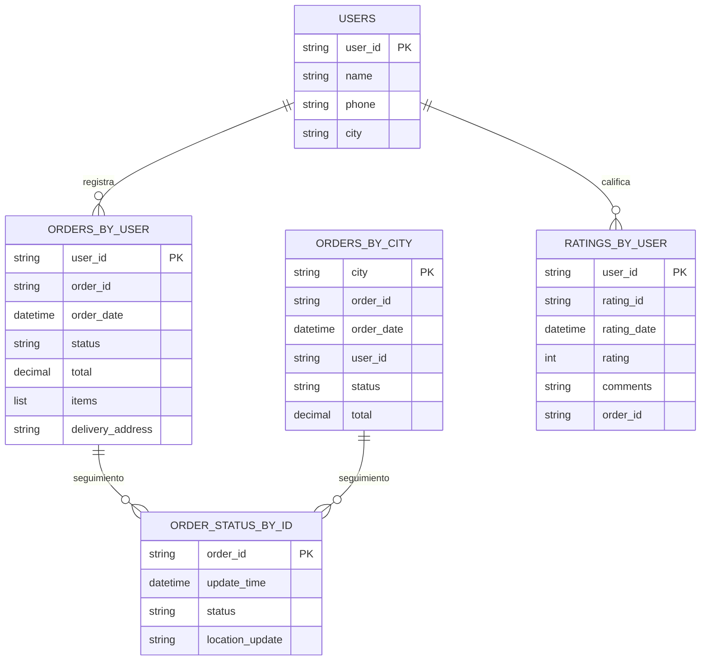
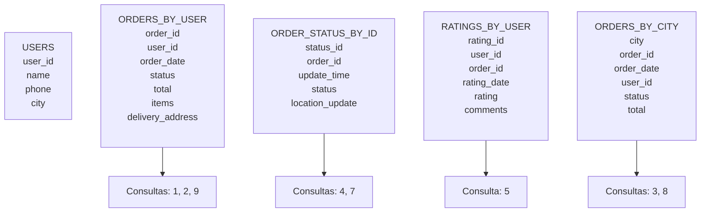

# FastEat

[Caso_de_Estudio_Cassandra_FastEat.pdf](attachment:121fed84-4e6c-4889-b742-9556eb20acb6:Caso_de_Estudio_Cassandra_FastEat.pdf)

## Análisis de Requerimientos

### Requisitos Funcionales

| N° | Requisito Funcional | Descripción |
| --- | --- | --- |
| RF1 | **Gestión de Pedidos Online** | El sistema debe permitir a los clientes crear pedidos de comida en línea desde la plataforma web o aplicación móvil. |
| RF2 | **Personalización de Pedidos** | Los usuarios deben poder personalizar sus pedidos (seleccionar ingredientes, tamaños, extras). |
| RF3 | **Seguimiento del Pedido en Tiempo Real** | El cliente debe poder consultar el estado actual del pedido (ej. en preparación, enviado, entregado). |
| RF4 | **Calificación del Servicio** | Los clientes deben poder calificar cada pedido después de la entrega, incluyendo comentarios y puntuaciones. |
| RF5 | **Historial de Pedidos** | La plataforma debe permitir consultar el historial completo de pedidos de cada usuario. |
| RF6 | **Sistema de Recomendaciones** | El sistema debe sugerir platos personalizados basados en el historial de pedidos y la ubicación del cliente. |
| RF7 | **Análisis de Preferencias** | El sistema debe procesar datos en tiempo real para obtener estadísticas de preferencias y tendencias de consumo. |
| RF8 | **Gestión de Estado de Entregas** | Los repartidores y operadores deben poder actualizar el estado del pedido (ej. asignado, en ruta, entregado). |
| RF9 | **Consultas de Reportes Operativos** | Los administradores deben poder generar reportes básicos de pedidos realizados, pedidos por ciudad, tiempos de entrega, etc. |
| RF10 | **Interacción desde API Externa (Python)** | El sistema debe poder integrarse con scripts Python para insertar, consultar, actualizar pedidos usando Cassandra-driver. |

### Requisitos no Funcionales

| N° | Requisito No Funcional | Descripción |
| --- | --- | --- |
| RNF1 | **Alta Disponibilidad (24/7)** | La plataforma debe operar de manera continua, sin interrupciones, aún ante fallos de nodos o servidores. |
| RNF2 | **Escalabilidad Horizontal** | El sistema debe permitir escalar agregando nodos Cassandra fácilmente para soportar aumento de carga. |
| RNF3 | **Tolerancia a Fallos** | La base de datos debe soportar replicación para evitar pérdida de datos si un nodo falla. |
| RNF4 | **Baja Latencia en Consultas** | Las consultas críticas (ej. pedidos activos, estados) deben ejecutarse en menos de 1 segundo, incluso en horarios pico. |
| RNF5 | **Despliegue Contenerizado** | El sistema debe ejecutarse en contenedores Docker para facilitar despliegue, mantenimiento y escalamiento. |
| RNF6 | **Consistencia Eventual** | El sistema puede aceptar un modelo de consistencia eventual para priorizar disponibilidad sobre consistencia inmediata. |
| RNF7 | **Facilidad de Monitoreo** | Debe existir facilidad para monitorear el estado de los nodos Cassandra (ejemplo usando herramientas como `nodetool`). |
| RNF8 | **Compatibilidad con Python/Jupyter** | El acceso a los datos debe poder realizarse desde entornos de análisis de datos (Jupyter Notebook usando Cassandra-driver). |
| RNF9 | **Procesamiento en Tiempo Real** | El sistema debe permitir el análisis inmediato de datos relevantes para recomendaciones y reportes. |
| RNF10 | **Soporte Multi-Región** *(si quieres agregarlo como reto opcional)* | La arquitectura debe poder adaptarse para soportar múltiples ciudades o regiones geográficas de forma eficiente. |

## Modelado de Datos

Para el modelado de datos, se tienen en cuenta las siguientes consultas que se pretenden realizar. 

| Consulta | Descripción | Frecuencia / Uso |
| --- | --- | --- |
| **1. Consultar Pedidos Activos por Usuario** | Mostrar todos los pedidos en curso (pendientes, en preparación, en ruta) para un usuario específico. | Frecuente: desde app móvil o web por cada usuario. |
| **2. Historial Completo de Pedidos por Usuario** | Listar pedidos antiguos realizados por el usuario para que pueda consultar qué ha pedido antes. | Frecuente: desde perfil del cliente o recomendaciones. |
| **3. Consultar Pedidos por Ciudad/Región** | Obtener lista de pedidos activos o históricos por zona geográfica. | Operativa: usado por repartidores o supervisores locales. |
| **4. Estado de Pedido por ID** | Consultar estado actual y detalles de un pedido específico (ej. rastreo en tiempo real). | Muy frecuente: cada cliente consulta su pedido en curso. |
| **5. Calificaciones por Usuario** | Listar calificaciones y comentarios de un cliente. | Ocasional: analítica o perfil del usuario. |
| **6. Recomendaciones Personalizadas** | Consultar historial de pedidos recientes para sugerir platos. | Cada vez que accede al menú. |
| **7. Actualizar Estado de Pedido** | Cambiar estado del pedido (ej. “preparación” a “enviado”). | Muy frecuente: desde backend o app del repartidor. |
| **8. Consultar Conteo de Pedidos por Ciudad o Día** | Reporte operativo rápido para ver volumen de pedidos por ciudad o fecha. | Diario: para monitoreo o reportes administrativos. |
| **9. Insertar un Pedido Nuevo** | Registrar un nuevo pedido en el sistema desde app/web. | Muy frecuente: cada vez que un cliente realiza pedido. |
| **10. Consultar Preferencias del Usuario** *(opcional para recomendaciones)* | Contar platos más pedidos o categorías preferidas de un usuario. | Recomendación: carga inicial del menú sugerido. |

### Relaciones



### JSON de ejemplo

```bash
nuevo_pedido = {
    "order_id": "x9y8z7",
    "user_id": "u789",
    "user_name": "Pedro Ruiz",
    "user_location": {
        "city": "Cuenca",
        "latitude": -2.8981,
        "longitude": -79.0045
    },
    "order_timestamp": "2025-07-16T10:00:00",
    "delivery_status": "Pendiente",
    "delivery_timestamp": None,
    "items": [
        {
            "item_id": "p404",
            "name": "Pizza Margarita",
            "quantity": 1,
            "customizations": []
        }
    ],
    "total_price": 9.99,
    "payment_method": "Tarjeta",
    "rating": None
}

```

### POSIBLE MODELADO



## Metodología para modelar en Cassandra (paso a paso):

### 1. **Identificar los casos de uso / consultas principales**

Primero defines **qué quieres consultar**. Cassandra se diseña pensando en **cómo vas a leer los datos**, no en la estructura lógica del negocio.

Ejemplo:

- Consultar pedidos por usuario.
- Consultar estado de un pedido por su ID.
- Consultar pedidos por ciudad.

### 2. **Definir las entidades clave y atributos**

Identificas las entidades principales (usuarios, pedidos, productos, etc.) pero **sin enfocarte en relaciones**. Cassandra no usa relaciones.

### 3. **Diseñar las consultas y qué datos necesitas en cada una**

Para cada caso de uso decides:

- ¿Qué filtros usarás?
- ¿Qué orden quieres?
- ¿Qué datos quieres devolver?

Esto nos guía para definir la **Partition Key** y **Clustering Key**.

### 4. **Definir particiones eficientes**

La **Partition Key** se elige para:

- Asegurar un buen **balance de datos entre nodos**.
- Evitar **particiones demasiado grandes** (problema común).
- Agrupar datos que suelen consultarse juntos.

### 5. **Elegir clustering keys para ordenar los datos**

Las **Clustering Keys** sirven para:

- Ordenar datos dentro de una partición.
- Hacer consultas eficientes como “últimos N registros”.

### 6. **Evitar operaciones ineficientes**

Reglas de oro:

- No hay JOIN, ni `GROUP BY`, ni `ORDER BY` global.
- Todo consulta rápida, idealmente por **Partition Key**.
- Prepara tablas “por consulta”, aunque haya **duplicación**.

## CQL para levantar las bases

## Estrategia de Despliegue en Docker

Docker Compose, manejamos el escalamiento horizontal.

## Inserción de Datos desde JSON en Jupyter

## Resultadoss